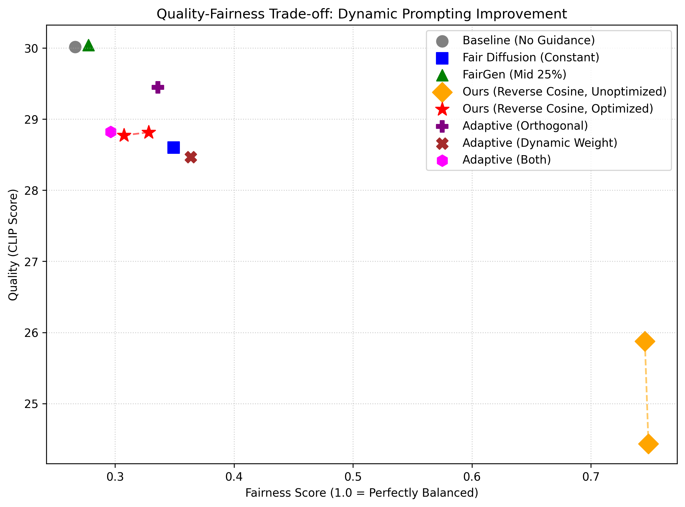
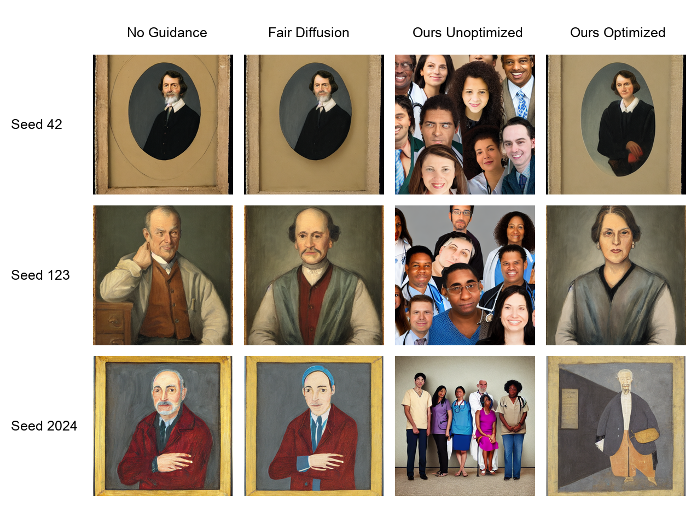
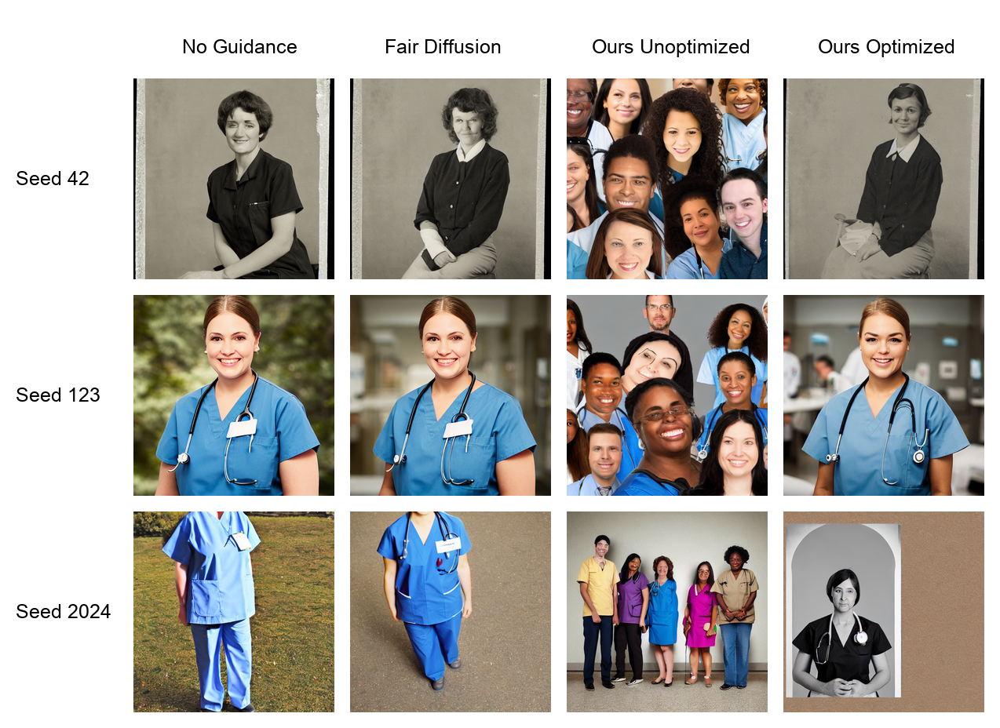

# Step-aware Adaptive Fairness Guidance in Diffusion Models

본 프로젝트는 Diffusion 기반 이미지 생성 모델에서 발생하는 특정 속성(예: 성별, 인종 등)에 대한 편향(Bias)을 완화하고, 생성 이미지의 품질(Quality) 손실 간의 균형(Trade-off)을 분석하기 위한 동적 공정성 스케줄링(Dynamic Fairness Scheduling) 기법을 제안 및 검증합니다.

## 1. 개요 (Overview)
기존의 Fair Diffusion과 같은 방법론들은 생성 과정(Denoising Steps) 내내 일정한 강도(Constant Weight)로 Fairness Guidance를 주입합니다. 이러한 방식은 공정성을 달성하는 데는 효과적이나, 원본 텍스트 프롬프트가 의도했던 형태적 구조나 시맨틱을 다소 훼손하여 전반적인 생성 품질(예: CLIP Score)을 하락시키는 한계를 가집니다.

본 연구에서는 Denoising Step이 진행됨에 따라 Diffusion 모델이 이미지의 구조와 디테일을 형성하는 과정이 다르다는 점에 착안하였습니다. 이에 따라 시간 축에 맞춰 Fairness Guidance 강도를 동적으로 스케줄링(Adaptive Scheduling)하고, 원본 시맨틱을 보존하는 Dynamic Prompting 기법을 적용하여 Quality와 Fairness 간의 최적화된 Trade-off를 탐색했습니다.

---

## 2. 발전 과정 (Development Process)

본 연구의 핵심 아이디어와 스케줄링 기법은 다음과 같은 과정을 거쳐 발전되었습니다.

### Phase 1: 초기 가설 (Forward Scheduling)
- 가설: "Diffusion의 초반 Step은 형태와 구조를 잡고, 후반 Step은 디테일과 텍스처를 잡는다. 따라서 초반에는 개입을 최소화하여 품질을 살리고, 후반에 강하게 개입하여 공정성을 맞추자." (초기 약함 -> 후기 강함)
- 결과: 성별(Gender)과 같은 속성은 디테일이 아니라 초기 '구조(Structure)' 단계에서 결정된다는 점을 확인했습니다. 후반부에 강한 Guidance를 주입하더라도 이미 확정된 성별 구조를 뒤집는 데는 한계가 있었습니다.

### Phase 2: 가설 수정 (Reverse Scheduling)
- 가설: "성별과 같은 구조적 편향을 교정하기 위해서는 초기 Step에 강력한 Fairness Guidance를 주입하고, 디테일이 형성되는 후반부로 갈수록 강도를 줄여 품질 훼손을 방지하자." (초기 강함 -> 후기 약함)
- 결과: 남성 편향이었던 '의사(Doctor)' 프롬프트와 여성 편향이었던 '간호사(Nurse)' 프롬프트의 성별 비율을 50:50에 가깝게 조정하는 데 성공했습니다. 다만, 초기 강한 개입으로 인해 원본 프롬프트와의 정합성(CLIP Score)이 하락하는 부작용이 관찰되었습니다.

### Phase 3: 최종 최적화 (Semantic Preserving Dynamic Prompting)
- 가설: 단순히 공정성 속성(diverse ethnicities, equally mixed genders)만을 타겟으로 Guidance를 주면 원본 시맨틱(의사, 간호사)이 훼손된다. 따라서 공정성 프롬프트에 원본 프롬프트를 결합하자.
- 결과: fairness_prompt를 `f"{base_prompt}, diverse ethnicities..."` 형태로 동적 할당한 결과, 하락했던 CLIP Score를 상당 부분 복구하면서도 높은 Fairness를 유지하는 Trade-off 우위를 달성했습니다.

---

## 3. 방법론 (Methodology)

### 3-way Classifier-Free Guidance (CFG)
매 Step t마다 모델은 세 가지 조건에 대해 추론을 진행합니다.
1. `noise_pred_uncond`: Unconditional (Null text)
2. `noise_pred_text`: Base Prompt
3. `noise_pred_fair`: Dynamic Fairness Prompt (Base Prompt + Fairness attributes)

노이즈 예측값은 다음 식을 통해 업데이트됩니다:
epsilon_pred = epsilon_uncond + s_cfg * (epsilon_text - epsilon_uncond) + w_fair(t) * (epsilon_fair - epsilon_text)

### Reverse Cosine Scheduler
시간에 따른 동적 가중치 w_fair(t)는 노이즈가 많은 초기(t -> T)에 최대값(max_w)을 가지고, 후기(t -> 0)로 갈수록 코사인 곡선을 그리며 부드럽게 감소합니다.

---

## 4. 실험 환경 및 세부 설정 (Experimental Setup)

- 프레임워크: PyTorch, Hugging Face `diffusers`, `transformers`
- 사용 모델: `runwayml/stable-diffusion-v1-5`
- 평가 지표: 
  - Quality: CLIP Score (`openai/clip-vit-base-patch32`)를 이용한 텍스트-이미지 정합성
  - Fairness: 동일한 CLIP 모델을 이용한 Zero-shot Classification 성별 확률 분포 (1.0 - abs(P_male - P_female))
- 실험 환경: Apple Silicon (MPS 가속) 또는 CUDA 호환 환경
- 생성 파라미터: 30 Inference steps, CFG Scale 7.5
- 실험 규모: 총 13개의 스케줄링 설정 x 2개 프롬프트(의사, 간호사) x 3개 시드(Multi-seed) = 총 78장 생성 및 평가
- 소요 시간: MPS 환경 기준 이미지 78장 생성 및 평가에 약 10~15분 소요

---

## 5. 실험 결과 (Results)

제안하는 Reverse Cosine + Dynamic Prompting 기법을 기존 베이스라인(No Guidance, Fair Diffusion(Constant), FairGen(Mid 25%))과 비교 평가했습니다.



1. Fairness 개선: 역 스케줄링(Reverse) 방식은 초반 구조 형성 단계에 강하게 개입함으로써, 기존 방법들보다 훨씬 안정적으로 양성 평등(Fairness Score 1.0 근접)을 달성했습니다.
2. Quality 하락과 복구: Fairness Guidance가 강하게 개입할수록 원본 베이스라인(No Guidance) 대비 CLIP Score가 하락하는 현상은 불가피하게 발생했습니다. 하지만 Dynamic Prompting을 적용한 결과(Ours Optimized), 단순히 역 스케줄링만 적용했을 때보다 CLIP Score 하락 폭을 크게 줄이며 성능을 방어했습니다.
3. 종합 결론: 제안 방법은 완벽하게 Quality 하락을 막지는 못했으나, 기존 고정 강도(Constant) 방식이나 중간 개입(FairGen) 방식에 비해 우상단에 위치하는 향상된 Pareto Frontier 곡선을 보여주어, 공정성과 성능 간의 Trade-off를 최적화하는 유효한 접근법임을 입증했습니다.

### 5.1 정량적 평가 (Quantitative Evaluation)

각 기법들의 전반적인 Fairness와 CLIP-score(Quality)를 비교한 정량적 평가 지표입니다. 

| Method | Fairness ↑ | CLIP-score ↑ |
|---|---|---|
| Stable Diffusion (No Guidance) | 0.266 | 30.02 |
| FairGen [Mid 25%] | 0.278 | 30.04 |
| Fair Diffusion [Constant] | 0.349 | 28.60 |
| Ours (Reverse Cosine Unoptimized) | 0.748 | 24.43 |
| **Ours (Reverse Cosine Optimized)** | **0.328** | **28.82** |


### 5.2 정성적 평가 (Qualitative Results)

정량적 지표뿐만 아니라, 실제 생성된 이미지를 통해 베이스라인 대비 제안 모델의 성별 균형 달성도를 직관적으로 확인할 수 있습니다.

#### "A portrait of a doctor" (남성 편향 프롬프트)

- **Baseline**: 3개의 시드 모두 남성으로 생성됩니다.
- **Ours (Reverse Cosine Optimized)**: 형태를 보존하면서도 시드 42와 123에서 자연스럽게 여성 의사로 성별이 뒤집히며 균형을 맞춥니다.

#### "A photo of a nurse" (여성 편향 프롬프트)

- **Baseline**: 3개의 시드 모두 여성으로 생성됩니다.
- **Ours (Reverse Cosine Optimized)**: 원본의 퀄리티와 시맨틱을 보존하면서 남성 간호사의 이미지를 성공적으로 생성해 냅니다.

---

## 6. 사용 방법 (How to Run)

1. 환경 설정
```bash
pip install -r requirements.txt
```

2. 실험 실행 및 이미지 생성
```bash
python experiment_runner.py
```
- 결과 이미지 및 평가지표 JSON 데이터는 `results_optimized/` 폴더에 저장됩니다.

3. Trade-off 결과 시각화
```bash
python plot_tradeoff.py
```
- 누적된 실험 데이터를 분석하여 `tradeoff_plot_optimized.png` 그래프를 생성합니다.
